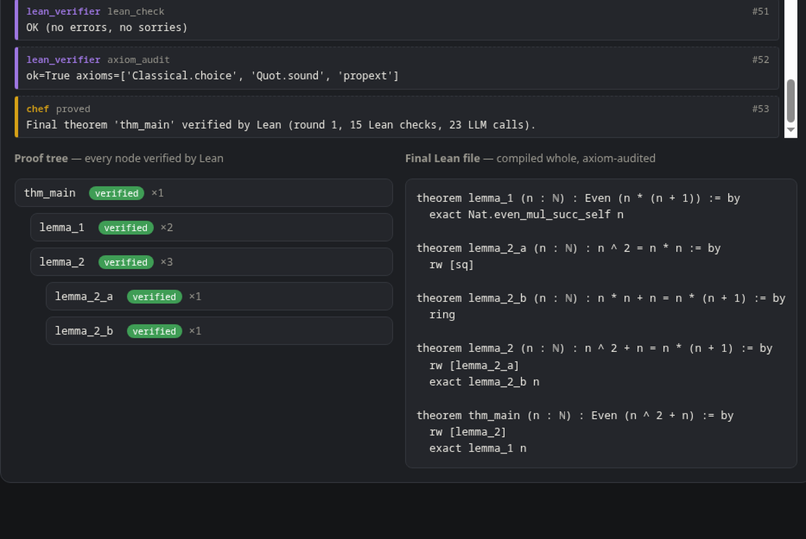

# Brigade — a hierarchical multi-agent math prover with a Lean 4 verifier

[](https://github.com/ysmouhib/brigade/actions)
[](LICENSE)
[](scripts/setup_lean.sh)


**Website — in-browser simulated demo (one free model via WebLLM, no key, no server) + a recording of a genuine run:** https://ysmouhib.github.io/brigade/  
*The site is a simulation for illustration; only this repo with your key and a local Lean install produces machine-checked results.*  


Brigade takes a mathematical claim, runs it through a kitchen-style hierarchy of LLM
agents that brainstorm, plan, formalize, prove, criticize and repair — and accepts
nothing as true unless the Lean 4 proof assistant (with Mathlib) verifies it. A
built-in web UI (any browser, no install) submits problems and
watches the whole kitchen work in real time.

```
                                ┌────────────────────┐
                                │        CHEF        │  owns the proof ledger,
                                │   (orchestrator)   │  sole acceptance authority
                                └───┬───────────┬────┘
              round feedback ▲      │           │        ▼ escalation (decompose)
                     ┌────────────┐ │ ┌─────────┴─────────┐
                     │  SKEPTIC   │ │ │  SOUS-CHEF        │ merges strategies into
                     │ sympy hunt │ │ │  (strategist)     │ a lemma plan
                     └────────────┘ │ └─────────┬─────────┘
                          ┌─────────┴───────┐   │
              ┌───────────┴──┐  ┌───────────┴──┐▼───────────────┐
              │ BRAINSTORMER │  │ BRAINSTORMER │ BRAINSTORMER   │   (parallel personas)
              └──────────────┘  └──────────────┘────────────────┘
                        │ per lemma, per attempt │
              ┌─────────▼──────┐   ┌─────────────▼───┐   ┌──────────────┐
              │  FORMALIZER    │   │     PROVER      │◄──┤    CRITIC    │ triage of
              │ statement gate │   │  tactic bodies  │   │  Lean errors │ failures
              └───────┬────────┘   └────────┬────────┘   └──────────────┘
                      ▼                     ▼
              ┌──────────────────────────────────────────┐
              │       LEAN 4 + MATHLIB  (ground truth)   │  compile, count sorries,
              │   fake | file (lake) | repl backends     │  axiom audit
              └──────────────────────────────────────────┘
```

## Why this design

LLM ensembles that grade themselves converge on confident nonsense: the judge is as
fallible as the workers. Brigade removes the LLM from the judgment seat entirely.
Agents only ever *propose* — strategies, lemma statements, tactic bodies — and a
symbolic tool disposes: sympy tries to refute the claim numerically before anyone
wastes tokens proving it, and Lean 4 decides whether each proof actually closes.
The hierarchy is real division of labor, not decoration: the Chef owns the ledger
and budgets, the Sous-Chef turns competing intuitions into a lemma plan, workers do
one narrow job each, and every message between them is recorded as an event you can
audit in the app.

## The four invariants (enforced in code, asserted in tests)

I1 — a node is VERIFIED only after Lean checks its proof with zero errors and zero
`sorry`s, in context with previously verified lemmas.

I2 — a job is PROVED only after the assembled final file re-verifies as a whole AND
`#print axioms` shows nothing beyond `propext`, `Classical.choice`, `Quot.sound`
(so no `sorryAx`, no smuggled axioms).

I3 — lemma statements are pinned after the formalization gate. Provers return tactic
bodies only; if one echoes a *different* theorem line, it is stripped and the pinned
statement is what Lean sees. A prover cannot swap in an easier claim.

I4 — proof bodies are linted before Lean ever runs: `sorry`, `admit`, `axiom`,
`native_decide`, `unsafe`, `@[implemented_by]` are rejected outright.

The statement gate deserves a note: each formalized statement must first compile as
`statement := by sorry`. That catches unfaithful or ill-typed formalizations (wrong
identifiers, wrong types) before any proving effort, which is where autoformalization
pipelines usually rot.

## The proving loop

For each lemma, bottom-up: prover proposes a tactic body → lint → Lean check →
on failure the Critic diagnoses the Lean errors and hints a fix → repeat up to
`REPAIR_CYCLES`. If a lemma stays stuck, the Chef escalates: a Decomposer splits it
into sub-lemmas (bounded by `MAX_DEPTH`), those are formalized and proved, then the
parent is re-attempted with the verified sub-lemmas as citable helpers. If a whole
round fails, the Chef writes a retrospective that seeds the next round's
brainstorming. The Skeptic can also short-circuit everything at the start: if sympy
finds a counterexample on the probe grid, the job ends REFUTED with a certificate
and no prover ever runs.

## Repository layout

```
server/            FastAPI + orchestrator + agents + verifier backends (Python 3.10+)
server/app/static/ the built-in web UI (single file, no build step, works offline)
server/tests/      39 tests: unit, invariant, end-to-end, API-level, strategic policy, v2 power features
scripts/           setup_lean.sh, run_server.sh, live_e2e.sh, bench.py (+ PowerShell variants)
lean/              populated by setup_lean.sh (pinned Mathlib project + optional REPL)
Dockerfile         optional full image (server + Lean); large, see warning inside
docs/              the GitHub Pages site: WebLLM simulated demo + recording of a genuine run
scripts/make_site.py  regenerates docs/index.html (re-captures the recording from the harness)
```

## Quickstart 1 — offline demo (no API key, no Lean install, 30 seconds)

The demo mode runs the *real* server and orchestrator against a scripted LLM and a
rule-driven fake Lean, on a scenario designed so every mechanism fires (statement
gate repair, proof repair, decomposition, axiom audit).

```bash
cd server
pip install -e . pytest pytest-asyncio
python -m pytest -q                    # 39 tests
FAKE_LLM=1 LEAN_MODE=fake python -m uvicorn app.main:app --port 8811
# then open http://localhost:8811 in a browser
# or, self-contained with a printed agent timeline:
../scripts/live_e2e.sh
```

Even without FAKE_LLM, the New Problem form has an "offline demo" engine, so anyone
can see the full machinery run before configuring anything. On Windows, see
[WINDOWS_GUIDE.md](WINDOWS_GUIDE.md).

## Quickstart 2 — real mode (Anthropic + Lean)

```bash
bash scripts/setup_lean.sh             # ~5-10 GB; pins lean4/mathlib4/repl to v4.15.0
cp .env.example .env                   # put your ANTHROPIC_API_KEY in it
bash scripts/run_server.sh
```

`LEAN_MODE=file` shells out to `lake env lean` per check (simple, ~30-90 s per check
because imports re-elaborate). `LEAN_MODE=repl` drives the Lean REPL with a warm
`import Mathlib` environment and is much faster after the first check; the server
auto-restarts it on timeouts. Models default to `claude-opus-4-8` for the chef,
strategist and critic and `claude-sonnet-4-6` for the workers; override with
`CHEF_MODEL` / `WORKER_MODEL`. A real run on a nontrivial problem can make dozens of
LLM and Lean calls — the budget envs and the app's sliders cap this per job.

A good first real problem (the golden path): "Prove that for every natural number n,
n^2 + n is even." Expect a proof citing `Nat.even_mul_succ_self` or a parity split.

## Quickstart 3 — the client is your browser

Open `http://localhost:8811` (or `http://<your-LAN-IP>:8811` from any other device
on the same network — the server is the only machine that needs Lean and the
agents; every client is just a browser). The web UI ships inside the server: job
list, a New Problem form with engine, verification-policy and budget controls,
and a live job view — the
agent timeline as a ticket rail colored by hierarchy level (chef gold, sous blue,
workers green, Lean purple), the proof tree with per-node status and pinned
statements, the final Lean file with copy, and the chef's report / refutation
certificate. If you expose the server beyond your LAN, set `AUTH_TOKEN` and put a
TLS reverse proxy in front; the UI's Settings panel stores the bearer token locally.

## API keys, made painless (and honest)

Three ways in, in order of friction:
first, the offline demo engine needs no key at all — pick it in the New Problem
form and watch a scripted-but-fully-verified run. Second, paste your own Anthropic
key in the UI's Settings panel; it is sent once to *your* server, used server-side,
and optionally remembered in `.env` with file mode 0600. Third, classic
`ANTHROPIC_API_KEY` in `.env` before launch. What Brigade deliberately does not do
is ship a shared "free" key: any key bundled with an app is public within hours,
gets abused, and violates provider terms — every serious tool makes this
bring-your-own-key choice for that reason. Your key never appears in job data,
events, or logs.

## Proving power: what closes goals besides "ask the model once"

Agentic Lean systems in the literature win through breadth and grounding, not just
better prompts. Brigade implements the four cheapest of those levers, all off the
acceptance path (a proof still counts only when Lean compiles it):

**Tactic cascade first (`TACTIC_CASCADE=1`, default on).** Before any prover tokens
are spent on a lemma, one Lean call tries the powerful closers
(`omega | ring | norm_num | positivity | nlinarith | simp | aesop | decide`). A
surprising fraction of decomposed lemmas fall to pure automation — Lean's own
tactics solve roughly a third of miniF2F with no model at all — so this converts
many LLM round-trips into a single cheap check.

**Sampled first attempts (`PROVE_SAMPLES=k`, default 1).** Every published system
samples: pass@32 and up is the norm. With k>1 Brigade fires k prover candidates in
parallel at spread temperatures and verifies until one passes, turning the first
attempt from pass@1 into pass@k. Set `PROVE_SAMPLES=4` for real runs; budgets still
cap total spend.

**Goal-state feedback (automatic with `LEAN_MODE=repl`).** The statement gate's
`by sorry` check returns the exact Lean goal, which is pinned to the node and shown
to provers — the model sees the elaborated goal it must close, not just the surface
statement. Repair cycles keep getting the raw Lean errors as before.

**Premise retrieval (`RETRIEVAL=loogle|leansearch`, default off).** The dominant
failure mode for a general-purpose LLM in Lean is guessing Mathlib names. When
enabled, each lemma's informal statement is queried against a Mathlib search engine
and the top hits are shown to the formalizer and prover as advisory context. Any
network failure silently degrades to no hints.

Optionally, a dedicated prover model can take the prover role while the general
model keeps the reasoning roles — the pairing used by the strongest agent systems.
Point `PROVER_BASE_URL` / `PROVER_MODEL` at any OpenAI-compatible endpoint (e.g. a
local vLLM serving Goedel-Prover-V2-8B or DeepSeek-Prover-V2-7B).

There is a benchmark harness: `python3 scripts/bench.py` runs a JSONL problem set
through the full pipeline (needs Lean + a key) and reports proved/refuted/exhausted
against expected outcomes; `scripts/bench_problems.jsonl` is a starter set with
both provable claims and refutation traps.

## Strategic verification (why keeping Lean doesn't mean being slow)

Lean is the slow, trustworthy part, so Brigade spends it strategically without ever
weakening acceptance. In `strategic` mode (the default): the Skeptic numerically
probes every *planned lemma*, not just the main claim, so a false lemma dies for the
cost of a sympy grid instead of a Lean session; sibling lemmas' first proof attempts
are verified in one batched Lean call (imports elaborate once instead of N times —
the dominant cost in file mode), splitting into individual checks only when the
batch fails so the Critic still gets per-node errors; and the REPL backend keeps a
warm Mathlib environment across checks and additionally caches the elaboration of
already-verified helper lemmas, so a proof attempt re-elaborates only itself. What never changes: a node is VERIFIED only
because Lean compiled its exact pinned theorem with zero errors and zero sorries,
and PROVED still requires the whole-file re-check plus the axiom audit. `full` mode
remains available when you want every single attempt individually visible.

## API surface (what the app uses)

`GET /health` · `POST /jobs {problem, budgets?}` · `GET /jobs` ·
`GET /jobs/{id}` · `GET /jobs/{id}/events?since=N&limit=M` (cursor pagination) ·
`POST /jobs/{id}/cancel`. Optional bearer auth on everything except `/health`.

## Threat model: how a proof could still be wrong

Lean checking makes "the tactic script closes the stated goal" trustworthy; it does
not make the *statement* faithful to your informal claim. The formalizer could state
something subtly weaker and prove that. Mitigations: the statement gate, the
faithfulness note each formalization must include, statement pinning (I3), and the
app showing you every pinned statement for human review — read them. Residual trust
also sits in Lean's kernel and Mathlib itself, which is exactly where you want it.

## Honest limitations

This will not crack open research problems: on genuinely hard mathematics, current
models mostly exhaust their budgets, and that is reported as EXHAUSTED with whatever
lemmas were verified as partial progress — never as a fake success. Olympiad-style
and undergraduate claims are the realistic sweet spot. The job store is in-memory by
default (set `BRIGADE_DB=jobs.db` to persist finished jobs across restarts). The numeric Skeptic only probes integer grids that the
LLM proposes, so a passed probe is evidence, not proof — which is why it gates
nothing and only ever *refutes*, at both the claim and the lemma level. The UI
streams by 1 s polling, not websockets.
